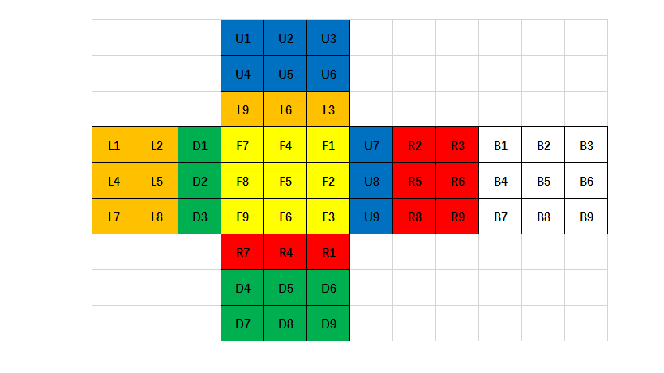

# 三阶魔方程序实现
通常我们见到的魔方都是比较基本的三阶魔方，除了三阶魔方外，还有四阶魔方、五阶魔方、钻石魔方、金字塔魔方等等。哥也不会3D图形编程，那么，如果用程序语言在命令行中实现一个简单的三阶魔方，这个还是比较容易的。

### 魔方的表示
把3D的图形展示在平面上，可任意这样做来表示


三阶魔方有6面，每卡块有 3 × 3 个色块，一共 3×3 ×6 块色块。用R、L、U、D、F、B、分别来表示右、左、上、下、前、后六个方向。可以用一个长度为54的数组表示，但是这样明显不好计算。那么可以换成二维数组表示，即用6个二维数组来表示每一个面的色块情况。

### 旋转方式
不管我们怎么旋转魔方都可以转化成对应面的顺时针或逆时针旋转90°这一基本方式，那么魔方共6面，即12种方式。而且逆时针可以从通过连续三次顺时针得到，最终简化后的操作为6种方式。

### 旋转影响



从左到右，从上到下，依次编序号，如果旋转F面，仅考虑F面的变化。
 可得到： F1-->F3, F2-->F6, F3-->F9, F4-->F2, F5-->F5, F6-->F8, F7-->F1, F8-->F4, F9-->F7
 再考虑对其他面的影响。
 那么我们观察可以得出旋转某一面可以分成两步：
 1. 考虑旋转面的情况； 旋转情况每个面的数组互换方式都一样；
 2. 考虑周围面的情况，会影响周围4个方向，共12块色片，每个面置换情况会有差异，得分别对待。

### 实现
通过以上，我们很快就可以写出程序。

```go
package main
import (
    "fmt"
    "os"
    "bufio"
)

/*
 思路：三阶魔方有6面，每卡块有 3*3 个色块，一共 3*3 * 6块色块。
     用R、L、U、D、F、B、分别来表示右、左、上、下、前、后六个方向。
     旋转方式分两种，如果是顺时针则直接写符号，例如F，则表示前面按顺时针旋转90°；
                   如果是逆时针则为f，表示前面按逆时针旋转90°。
     由此，可以得到最基本的旋转一共有6种，逆时针可以用三次顺时针得到。
     从左到右，从上到下，依次编序号，如果旋转F面，仅考虑F面的变化。
     可得到： F1-->F3, F2-->F6, F3-->F9, F4-->F2, F5-->F5, F6-->F8, F7-->F1, F8-->F4, F9-->F7
     再考虑对其他面的影响。
     那么旋转某一面可以分成两步：
     1、考虑旋转面的情况； 旋转情况每个面的数组互换方式都一样；
     2、考虑周围面的情况，会影响周围4个方向，共12块色片，每个面置换情况会有差异，
 */

type RubikCube struct {
    R [3][3]string
    L [3][3]string
    U [3][3]string
    D [3][3]string
    F [3][3]string
    B [3][3]string
}


type Rotation interface {
    rotateR()
    rotateL()
    rotateU()
    rotateD()
    rotateF()
    rotateB()
}

func (r *RubikCube) rotateR() {
    r.R[0][0], r.R[0][1], r.R[0][2],
    r.R[1][0], r.R[1][1], r.R[1][2],
    r.R[2][0], r.R[2][1], r.R[2][2] =
    r.R[2][0], r.R[1][0], r.R[0][0],
    r.R[2][1], r.R[1][1], r.R[0][1],
    r.R[2][2], r.R[1][2], r.R[0][2]

    // F U B D
    // F 第三列
    // U 第三列
    // B 第一列
    // D 第三列
    r.F[0][2], r.F[1][2], r.F[2][2],
    r.U[0][2], r.U[1][2], r.U[2][2],
    r.B[0][0], r.B[1][0], r.B[2][0],
    r.D[0][2], r.D[1][2], r.D[2][2] =

    r.D[0][2], r.D[1][2], r.D[2][2],
    r.F[0][2], r.F[1][2], r.F[2][2],
    r.U[2][2], r.U[1][2], r.U[0][2],
    r.B[2][0], r.B[1][0], r.B[0][0]
}

func (r *RubikCube) rotateL() {
    r.L[0][0], r.L[0][1], r.L[0][2],
    r.L[1][0], r.L[1][1], r.L[1][2],
    r.L[2][0], r.L[2][1], r.L[2][2] =
    r.L[2][0], r.L[1][0], r.L[0][0],
    r.L[2][1], r.L[1][1], r.L[0][1],
    r.L[2][2], r.L[1][2], r.L[0][2]

    // B U F D
    // B 第三列
    // U 第一列
    // F 第一列
    // D 第一列
    r.B[0][2], r.B[1][2], r.B[2][2],
    r.U[0][0], r.U[1][0], r.U[2][0],
    r.F[0][0], r.F[1][0], r.F[2][0],
    r.D[0][0], r.D[1][0], r.D[2][0] =

    r.D[2][0], r.D[1][0], r.D[0][0],
    r.B[2][2], r.B[1][2], r.B[0][2],
    r.U[0][0], r.U[1][0], r.U[2][0],
    r.F[0][0], r.F[1][0], r.F[2][0]
}

func (r *RubikCube) rotateU() {
    r.U[0][0], r.U[0][1], r.U[0][2],
    r.U[1][0], r.U[1][1], r.U[1][2],
    r.U[2][0], r.U[2][1], r.U[2][2] =
    r.U[2][0], r.U[1][0], r.U[0][0],
    r.U[2][1], r.U[1][1], r.U[0][1],
    r.U[2][2], r.U[1][2], r.U[0][2]

    // L B R F
    // L 第一行
    // B 第一行
    // R 第一行
    // F 第一行
    r.L[0][0], r.L[0][1], r.L[0][2],
    r.B[0][0], r.B[0][1], r.B[0][2],
    r.R[0][0], r.R[0][1], r.R[0][2],
    r.F[0][0], r.F[0][1], r.F[0][2] =

    r.F[0][0], r.F[0][1], r.F[0][2],
    r.L[0][0], r.L[0][1], r.L[0][2],
    r.B[0][0], r.B[0][1], r.B[0][2],
    r.R[0][0], r.R[0][1], r.R[0][2]
}

func (r *RubikCube) rotateD() {
    r.D[0][0], r.D[0][1], r.D[0][2],
    r.D[1][0], r.D[1][1], r.D[1][2],
    r.D[2][0], r.D[2][1], r.D[2][2] =
    r.D[2][0], r.D[1][0], r.D[0][0],
    r.D[2][1], r.D[1][1], r.D[0][1],
    r.D[2][2], r.D[1][2], r.D[0][2]

    // L F R B
    // L 第三行
    // F 第三行
    // R 第三行
    // B 第三行
    r.L[2][0], r.L[2][1], r.L[2][2],
    r.F[2][0], r.F[2][1], r.F[2][2],
    r.R[2][0], r.R[2][1], r.R[2][2],
    r.B[2][0], r.B[2][1], r.B[2][2] =

    r.B[2][0], r.B[2][1], r.B[2][2],
    r.L[2][0], r.L[2][1], r.L[2][2],
    r.F[2][0], r.F[2][1], r.F[2][2],
    r.R[2][0], r.R[2][1], r.R[2][2]
}

func (r *RubikCube) rotateF() {
    r.F[0][0], r.F[0][1], r.F[0][2],
    r.F[1][0], r.F[1][1], r.F[1][2],
    r.F[2][0], r.F[2][1], r.F[2][2] =
    r.F[2][0], r.F[1][0], r.F[0][0],
    r.F[2][1], r.F[1][1], r.F[0][1],
    r.F[2][2], r.F[1][2], r.F[0][2]

    // L U R D
    // L 第三列
    // U 第三行
    // R 第一列
    // D 第一行
    r.L[0][2], r.L[1][2], r.L[2][2],
    r.U[2][0], r.U[2][1], r.U[2][2],
    r.R[0][0], r.R[1][0], r.R[2][0],
    r.D[0][0], r.D[0][1], r.D[0][2] =

    r.D[0][0], r.D[0][1], r.D[0][2],
    r.L[2][2], r.L[1][2], r.L[0][2],
    r.U[2][0], r.U[2][1], r.U[2][2],
    r.R[2][0], r.R[1][0], r.R[0][0]
}

func (r *RubikCube) rotateB() {
    r.B[0][0], r.B[0][1], r.B[0][2],
    r.B[1][0], r.B[1][1], r.B[1][2],
    r.B[2][0], r.B[2][1], r.B[2][2] =
    r.B[2][0], r.B[1][0], r.B[0][0],
    r.B[2][1], r.B[1][1], r.B[0][1],
    r.B[2][2], r.B[1][2], r.B[0][2]

    // R U L D
    // R 第三列
    // U 第一行
    // L 第一列
    // D 第三行
    r.R[0][2], r.R[1][2], r.R[2][2],
    r.U[0][0], r.U[0][1], r.U[0][2],
    r.L[0][0], r.L[1][0], r.L[2][0],
    r.D[2][0], r.D[2][1], r.D[2][2] =

    r.D[2][2], r.D[2][1], r.D[2][0],
    r.R[0][2], r.R[1][2], r.R[2][2],
    r.U[0][2], r.U[0][1], r.U[0][0],
    r.L[0][0], r.L[1][0], r.L[2][0]
}

// 打印图形
func (r *RubikCube) print() {
    for i := 0; i < 9; i++ {
        for j := 0; j < 12; j++ {
            fmt.Print("  ")
            if i >= 0 && i <= 2  && j >= 3 && j <= 5 {
                fmt.Print(r.U[i][j - 3])
            }else if i >= 3 && i <= 5 {
                if j >= 0 && j <= 2 {
                    fmt.Print(r.L[i - 3][j])
                }else if j >= 3 && j <= 5 {
                    fmt.Print(r.F[i - 3][j - 3])
                }else if j >= 6 && j <= 8 {
                    fmt.Print(r.R[i - 3][j - 6])
                } else if j >= 9 && j <= 11 {
                    fmt.Print(r.B[i - 3][j - 9])
                }
            }else if i >= 6 && i <= 8 && j >= 3 && j <= 5 {
                fmt.Print(r.D[i - 6][j - 3])
            }else {
                fmt.Print("  ")
            }
        }
        fmt.Println("")
    }
}

// 打印帮助信息
func printHelp() {
    fmt.Println("------------------Help-------------------")
    fmt.Println("    R、L、U、D、F、B、分别来表示右、左、上、下、前、后六个方向")
    fmt.Println("    顺时针旋转，则输入对应面大写字母")
    fmt.Println("    逆时针旋转，则输入对应面小写字母")
    fmt.Println("    每次输入一个命令")
    fmt.Println("    输入 h或H，打印出帮助信息")
    fmt.Println("    输入 P或p，打印出当前魔方图形排列")
    fmt.Println("------------------Help-------------------")

}

func main() {
    printHelp()

    // 初始化
    rubikCube := RubikCube{
        R:[3][3]string{{"R1", "R2", "R3"}, {"R4", "R5", "R6"}, {"R7", "R8", "R9"}},
        L:[3][3]string{{"L1", "L2", "L3"}, {"L4", "L5", "L6"}, {"L7", "L8", "L9"}},
        U:[3][3]string{{"U1", "U2", "U3"}, {"U4", "U5", "U6"}, {"U7", "U8", "U9"}},
        D:[3][3]string{{"D1", "D2", "D3"}, {"D4", "D5", "D6"}, {"D7", "D8", "D9"}},
        F:[3][3]string{{"F1", "F2", "F3"}, {"F4", "F5", "F6"}, {"F7", "F8", "F9"}},
        B:[3][3]string{{"B1", "B2", "B3"}, {"B4", "B5", "B6"}, {"B7", "B8", "B9"}},
    }
    rubikCube.print()
    fmt.Print("Please input your commmand : ")

    cmdRead := bufio.NewScanner(os.Stdin)
    for cmdRead.Scan() {
        cmdStr := cmdRead.Text()
        switch cmdStr{
        case "R":
            rubikCube.rotateR()
        case "r":
            rubikCube.rotateR()
            rubikCube.rotateR()
            rubikCube.rotateR()
        case "L":
            rubikCube.rotateL()
        case "l":
            rubikCube.rotateL()
            rubikCube.rotateL()
            rubikCube.rotateL()
        case "U":
            rubikCube.rotateU()
        case "u":
            rubikCube.rotateU()
            rubikCube.rotateU()
            rubikCube.rotateU()
        case "D":
            rubikCube.rotateD()
        case "d":
            rubikCube.rotateD()
            rubikCube.rotateD()
            rubikCube.rotateD()
        case "F":
            rubikCube.rotateF()
        case "f":
            rubikCube.rotateF()
            rubikCube.rotateF()
            rubikCube.rotateF()
        case "B":
            rubikCube.rotateB()
        case "b":
            rubikCube.rotateB()
            rubikCube.rotateB()
            rubikCube.rotateB()
        case "p", "P":
            rubikCube.print()
        case "quit":
            os.Exit(0)
        default:
            fmt.Println("Input Error! please input again. You can input 'h' to get help information.")
        }
    }
}
```

Result：
