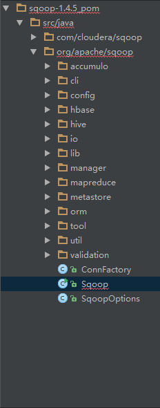

# 概述 #
从官网下载源码导入IDE，我们可以看到源码包的结构（如图）。因为Sqoop原来是Cloudera的东西，后来移到了Apache项目里，所以这里有`com.cloudera.sqoop`和`org.apache.sqoop`两个包。com.cloudera.sqoop下的东西都已废弃，但是`org.apache.sqoop`下的源码还会引用它。

仔细看一下有哪些包，以及包的用途：
- accumulo：Apache Accumulo 是一个可靠的、可伸缩的、高性能的排序分布式的 Key-Value 存储解决方案，基于单元访问控制以及可定制的服务器端处理，不了解，忽略。
- cli：跟命令行相关；
- config：配置相关；
- hbase：HBase相关；
- hive：Hive相关；
- io：实现了`java.io.*`接口，也就是，OutputStream and Writer；
- lib：公共的API；
- manager：ConnManager 和 ManagerFactory 接口，以及它们相关实现，这里主要是跟数据连接相关，不同的数据库有不同的相关实现；
- mapreduce：与Mapreduce API相关的交互类；
- orm：ORM代码自动生成；
- tool：SqoopTool实现。也就是根据用户的输入操作例如，import, export, codegen等调用不同的SqoopTool实现；
- util：各种辅助工具；
- validation：验证相关参数；