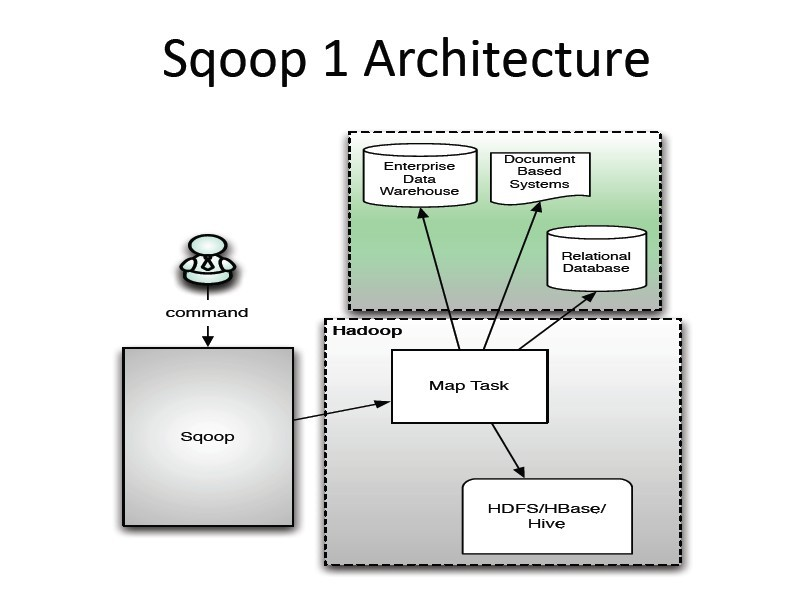

# Why #
为什么会有这篇东西？主要是工作中需要调研相关东西，本着学习的目的，顺便记录下来。

# Introduction #
Sqoop主要用来在Hadoop和关系数据库中传递数据。通过Sqoop，我们可以方便的将数据从关系数据库导入到Hadoop集群中，或者将数据从Hadoop导出到关系数据库。目前，Sqoop分为Sqoop1和Sqoop2，两者是架构不同，也不兼容。本文所有Sqoop源码分析默认为Sqoop1，不涉及Sqoop2。

## 架构 ##
首先，我们看一下Sqoop 1 的架构。我们可以看到Sqoop的架构不是很复杂。使用者通过在命令行下执行Sqoop命令，根据输入条件，生成mapreduce作业，并在Hadoop集群上运行，通过mapreduce任务来传输数据，从而提供并发特性和容错的能力。

# Contents #
- 0-概述
- 1-程序流程
- 2-ImporTool分析
- 3-export分析
